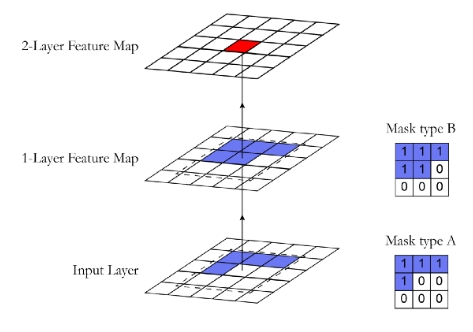

参考：

1. 论文：[https://arxiv.org/abs/1606.05328](https://arxiv.org/abs/1606.05328)
2. https://zhuanlan.zhihu.com/p/415246165
3. 代码：https://keras.io/examples/generative/pixelcnn/
4. https://medium.com/data-science-in-your-pocket/generative-modeling-using-pixelcnn-with-codes-explained-387c95405651

要点：

1. 自回归：过去的元素去预测现在的元素：**使用过去的像素，预测下一个像素**

2. 在传统的 CNN 中，我们不会将图像视为像素序列，而是将整个图像作为输入，使用卷积层、最大/平均池和其他操作应用滤波器并获得输出。

3. PixelCNN，我们正在做相同的事情，但在卷积层的内核上使用 Masked 版本

   简单说，就是在卷积核上套一层掩码，掩码可以通过将所有不应考虑的像素归零来完成。值为1代表参与计算，值为0代表计算屏蔽

   两种掩码类型：

   

   掩码类型 A：此掩码仅应用于第一个卷积层。 它通过将掩码中的中心像素归零来限制对像素的访问。 这样，我们保证模型不会访问它即将预测的像素（下图中的红色部分）。

   掩码类型 B：此掩码应用于所有后续卷积层，并通过允许从像素到自身的连接来放宽掩码 A 的限制。 这对于解释第一层的像素预测很重要。