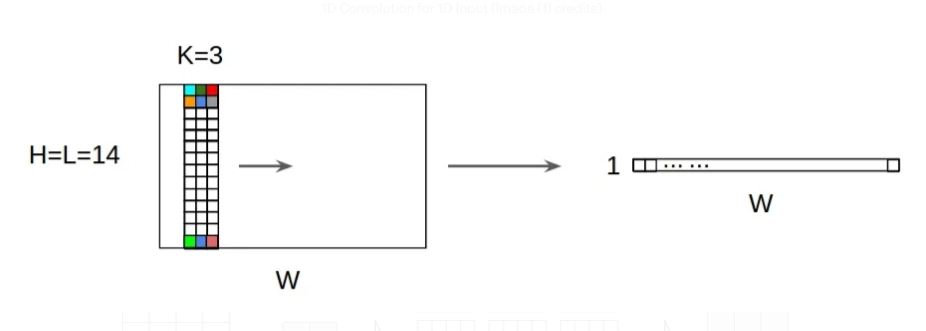
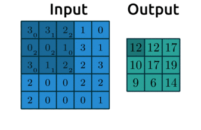
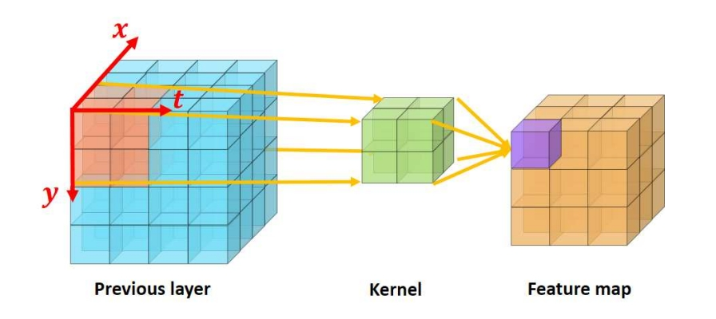
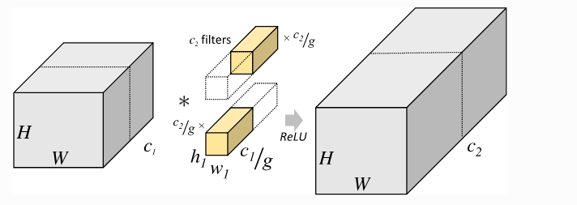
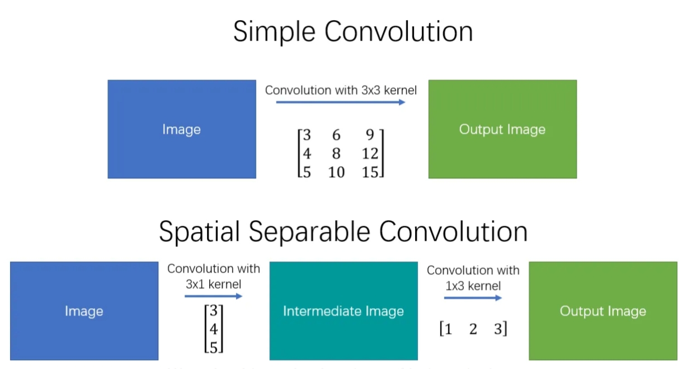
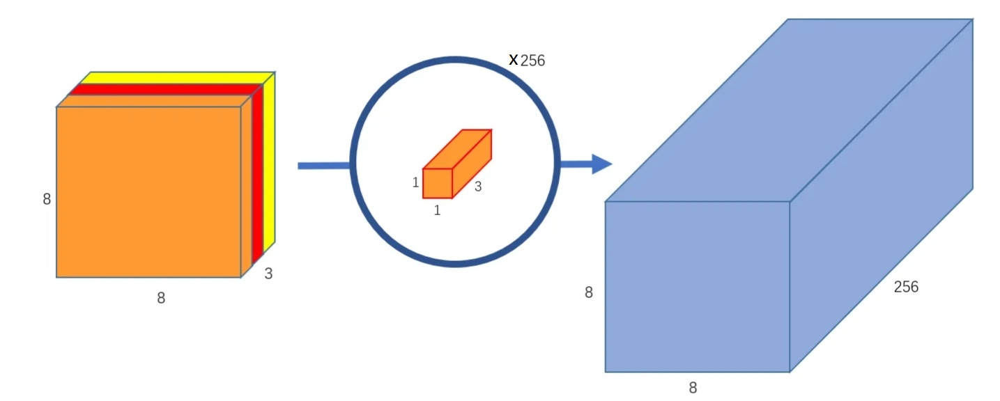
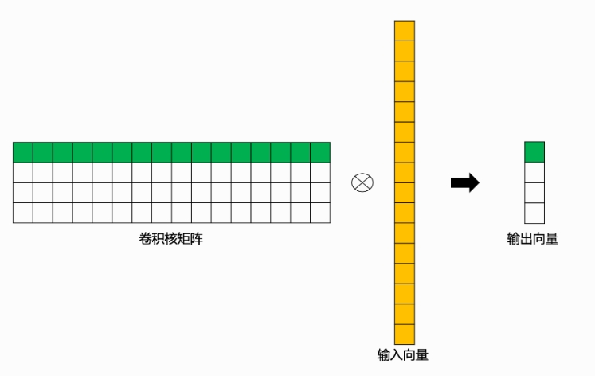
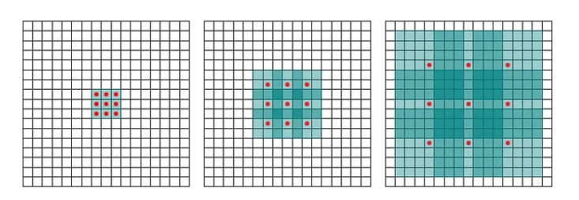

# overview

## 标准卷积：2d

1. torch.nn.Conv2d
2. 参数是：**(kernel_num,input_channels,kernel_h,kernel_w)**（卷积核数量，输入通道数，卷积核高，卷积核宽）
3. 输入：**(batch_size,channels,higth,width)**针对的是2维张量图片，图片自身属性带有通道数。额外还有批量数。


## 卷积维度：1d、2d、3d

卷积的维度并没有想象中复杂，一个普遍适用的理解：

1. 无论是1d、2d还是3d的卷积，**输入数据、输出数据以及卷积参数**的尺寸都要在**卷积维度**的基础上**+2**，比如：

   `nn.ConvXd`是X维卷积，卷积参数：(kernel_num,C~in~，\*X)，输入数据:（batch,C~in~,\*X）,输出数据:（batch,kernel_num,\*X）

2. 对于X维卷积`nn.ConvXd`，约束的其实是卷积核的尺寸，换句话说，**X维卷积`nn.ConvXd`的参数`kernel_size`必须是X维的**

3. 无论是1d、2d还是3d的卷积，卷积操作都是一样的：**X维度的卷积核在X维度数据上滑动计算**，只是，**输入数据、输出数据以及卷积参数**的尺寸都要在**卷积维度X**的基础上**+2**

- nn.Conv1d

  **1D输入**
  
  
  
  **2D输入**
  
  
  
- nn.Conv2d

  **2D输入**

  

  **3D输入**

  

- nn.Conv3d

  **3D输入**

  

  **4D输入**

  

## 分组卷积Group Convolution

把握3个要点：

1. 对什么分组

   **输入数据进行分组，并且是只对某一个维度分组，其他维度不变**。前面提到**X维卷积`nn.ConvXd`要在卷积维度**的基础上**+2**，以标准的`nn.Conv2d`为例，卷积的是高度和宽度两个维度，扩展的第一个维度是通道，扩展的第二个维度是批量。那么具体来说，**分组卷积是对输入数据扩展的第一维度进行分组，其他维度不变。**

2. 分组的共同操作

   分组的每个集合，完成标准卷积：**先卷积在求和**

3. 卷积核尺寸：

   $(C_{out},C_{in}/groups,h\_kernel,w\_kernel)$

   

比如2D卷积`nn.Conv2d(64,128,3,groups=4)`，输入数据尺寸是`(32,64,28,28)`，分组卷积4组，首先是对通道数64分组，每组`64/4=16`通道。不考虑批量，输入数据每组是`(16,28,28)`，**每个组的共同卷积操作是先卷积再求和，不同组不求和**，设置输出的通道是128，由于不同组不求和，那么每个通道的卷积核数量是`128/4=32`，所以每个组卷积核尺寸是`(32,16,3,3)`，总共的卷积核尺寸是(128,16,3,3)

**标准卷积其实是分组为1的特例**

```python
import torch
i= torch.randn(32,64,28,28) 

#标准卷积
conv=torch.nn.Conv2d(64,128,3,groups=1)
out=conv(i)
print(out.shape)  #[32, 128, 26, 26]
# 获取卷积层的参数字典
conv_params = conv.state_dict()
w=conv.weight.data
# w=conv_params['weight']
print(w.shape)#[128, 64, 3, 3]


#分组卷积
conv_group=torch.nn.Conv2d(64,128,3,groups=4)
out=conv_group(i)
print(out.shape)   #[32, 128, 26, 26]
# 获取卷积层的参数字典
conv_group_params = conv_group.state_dict()
w=conv_group.weight.data
# w=conv_group_params['weight']
print(w.shape)#[128, 16, 3, 3]
```

## 可分离卷积separable convolutions

参考：

1. [A Basic Introduction to Separable Convolutions | by Chi-Feng Wang | Towards Data Science](https://towardsdatascience.com/a-basic-introduction-to-separable-convolutions-b99ec3102728)
2. [Depthwise Separable Convolutions in PyTorch](https://www.paepper.com/blog/posts/depthwise-separable-convolutions-in-pytorch/)

可分离卷积其实有两种类型：

1. 空间可分离卷积spatial separable convolutions
2. 深度可分离卷积depthwise separable convolutions

### 空间可分离卷积

想法很简单，**对卷积核进行分解**，最常见的情况是将 3x3 内核分为 3x1 和 1x3 内核


简单说，在卷积运算中，一个9次乘法变成了2个三次乘法。效果不变，但是乘法操作减少，计算复杂性就降低了，网络运行速度也就更快了



但是有局限性：**并非所有的卷积核都可以拆分成两个较小的卷积核。 所以这种方法使用的并不多。**

### 深度可分离卷积

分为两部分，两者配合互不分离：

1. 深度卷积Depthwise Convolution
2. 逐点卷积Pointwise Convolution

#### 深度卷积Depthwise Convolution

其实就是一个分组卷积，只是对输入数据的分组是，**每组一个通道，有多少通道就有多少分组**


在pytorch中并没有专门设计Depthwise Convolution的API函数，可以自己用卷积里的分组参数groups来实现：

```python
from torch.nn import Conv2d
import torch

x = torch.rand(5, 3, 12, 12)

#深度卷积，其实就是分组数=输入通道数
depth_conv = Conv2d(in_channels=3, out_channels=3, kernel_size=5, groups=3)

out_depth=depth_conv(x)
print(out_depth.shape) #[5, 3, 8, 8]
print(depth_conv.weight.data.shape)#[3, 1, 5, 5]

```

#### 逐点卷积Pointwise Convolution

**其实就是卷积核尺寸为`1x1`的标准卷积**



**深度可分离卷积可以极大减少计算量**

## 1x1卷积

也就是不去考虑输入数据局部信息之间的关系，而把关注点放在不同通道间

作用：

1. 实现信息的跨通道交互与整合。考虑到卷积运算的输入输出都是3个维度（宽、高、多通道），所以`1x1` 卷积实际上就是对每个像素点，在不同的通道上进行线性组合，从而整合不同通道的信息。
2. 对卷积核通道数进行降维和升维，减少参数量。经过`1x1`卷积后的输出保留了输入数据的原有平面结构，通过调控通道数，从而完成升维或降维的作用。
3. 利用`1x1`卷积后的非线性激活函数，在保持特征图尺寸不变的前提下，**大幅增加非线性**

尤其是第三点很关键

## 转置卷积Transpose Convolution

简单说就是，**输入数据的逐个像素点和卷积核相乘，得到的结果滑窗排列，重叠部分相加**


1. 背景

   标准卷积会使输出图像的尺寸会变得很小，而对于某些特定的任务（比如：图像分割、GAN），我们需要将图像恢复到原来的尺寸再进行进一步的计算。

   这个恢复图像尺寸，实现图像由小分辨率到大分辨率映射的操作，叫做**上采样（Upsample**）。

   上采样有多种方式，常见的包括：**最近邻插值（Nearest neighbor interpolation）、双线性插值（Bi-Linear interpolation）**等，但是这些上采样方法都是基于人们的先验经验来设计的，对于很多场景效果并不理想。

   转置卷积（Transpose Convolution），在某些文献中也被称为反卷积（**Deconvolution**）。转置卷积中，**不会使用预先设定的插值方法，它具有可学习的参数**，通过让网络自行学习，来获取最优的上采样方式。

   转置卷积在某些特定的领域有着非常广泛的应用，比如：

   - 在DCGAN，生成器将会用随机值转变为一个全尺寸(full-size)的图片，这个时候就需要用到转置卷积。
   - 在语义分割中，会使用卷积层在编码器中进行特征提取，然后在解码层中进行恢复为原先的尺寸，这样才可以对原来图像的每个像素都进行分类。这个过程同样需要用到转置卷积。经典方法如：FCN和Unet。
   - CNN的可视化：通过转置卷积将CNN中得到的特征图还原到像素空间，以观察特定的特征图对哪些模式的图像敏感。

2. “转置”提现在哪

   需要明白一点：**卷积本质是一个线性变化，线性变换本质是矩阵乘法**

   

   比如标准卷积：
   $$
   \pmb{o}=C\pmb{i}
   $$
   

   根据卷积运算规则，构建卷积核矩阵$K$和输入向量$\pmb{i}$

   
   $$
   \pmb{i}=\begin{bmatrix} x_1 \\ x_2 \\ \vdots \\ x_17 \end{bmatrix}
   $$
   验证一下，确实如此：**卷积本质是一个线性变化，线性变换本质是矩阵乘法**

   至于转置卷积，其实是
   $$
   \pmb{o}=C^T\pmb{i}
   $$
   

## 空洞卷积Dilated Convolution

参考：

1. [Convolution arithmetic](https://github.com/vdumoulin/conv_arithmetic/blob/master/README.md)
2. [空洞卷积（Dilated Convolution）](https://paddlepedia.readthedocs.io/en/latest/tutorials/CNN/convolution_operator/Dilated_Convolution.html)

**也叫扩张卷积**，简单说就是，在标准卷积的基础上，增加一个**扩张率**的概念，它控制卷积核中相邻元素间的距离。

（蓝色输入，青色输出）


扩张率其实就是`nn.ConvXd(dilation=1)`中的*dilation*参数



从左到右，扩张率分别是1,2,4

没错，**标准卷积其实就是扩张率为1的特例**

1. **动机：为什么要设计空洞卷积？**

   在**像素级**预测问题中（比如**语义分割**，这里以FCN为例进行说明），图像输入到网络中，FCN先**如同传统的CNN网络一样对图像做卷积以及池化计算，降低特征图尺寸的同时增大感受野，然后使用转置卷积（Transpose Convolution）进行上采样使得输出图像的尺寸与原始的输入图像保持一致**。

   综上，在这种像素级预测问题中，就有两个关键步骤：**首先是使用卷积或者池化操作减小图像尺寸，增大感受野；其次是使用上采样扩大图像尺寸。**

   但是，使用卷积或者池化操作进行下采样会导致一个非常严重的问题：**图像细节信息被丢失，小物体信息将无法被重建(假设有4个步长为2的池化层，则任何小于 2^4^pixel 的物体信息将理论上无法重建)。**

2. 空洞卷积带来更大的感受野

   标准卷积的感受野

   

   很直观，空洞卷积的感受野会更大，并且没有增加参数。

    空洞卷积可以通过不同的空洞率实现多尺度信息的获取。通过在网络中使用不同空洞率的空洞卷积，可以捕捉不同尺度的特征，有助于提高模型对于多尺度物体或结构的识别性能。

## 可变形卷积

参考：

1. [可变形卷积](https://paddlepedia.readthedocs.io/en/latest/tutorials/CNN/convolution_operator/Deformable_Convolution.html#id1)
2. [Deformable Convolutional Networks](https://arxiv.org/pdf/1703.06211.pdf)

## 扩展：感受野Receptive Field

参考：

1. https://theaisummer.com/receptive-field/

# nn.Conv1d

参考：

1. [Keras之文本分类实现 - 知乎 (zhihu.com)](https://zhuanlan.zhihu.com/p/29201491)
2. [PyTorch: Conv1D For Text Classification Tasks --- PyTorch：用于文本分类任务的 Conv1D (coderzcolumn.com)](https://coderzcolumn.com/tutorials/artificial-intelligence/pytorch-conv1d-for-text-classification)

**通过`nn.Conv1d`文本分类，进行卷积处理的不是词向量，而是文本长度**

换句话说，如果`nn.Conv1d`的输入数据是**(batch,text_len,embedding_size)**，那么必须还有一个额外操作：text_len和embedding_size两个维度交换位置

```python
torch.nn.Conv1d(in_channels, 
                out_channels, 
                kernel_size, 
                stride=1, 
                padding=0, 
                dilation=1, 
                groups=1, 
                bias=True, 
                padding_mode='zeros', 
                device=None, 
                dtype=None
               )
```


# nn.Conv2d

```python
torch.nn.Conv2d(in_channels,
                out_channels,
                kernel_size,
                stride=1,
                padding=0, 
                dilation=1, 
                groups=1, 
                bias=True,
                padding_mode='zeros',
                device=None, 
                dtype=None
               )

```

- 参数

  1. `in_channels(int)`：表示输入数据的通道数$C_{in}$
  2. `out_channels`(int)：表示**卷积核（卷积滤波器）的数量**。每个卷积核都会生成一个输出特征，所以这也是卷积层输出的特征图数量图$C_{out}$
  3. `kernel_size(int or tuple)`：指定卷积核的大小，通常是**一个整数int或一个元组tuple (height, width)**。例如，`kernel_size=3` 表示一个 3x3 的卷积核。
  4. `stride(int or tuple)`：指定卷积操作的步幅，即卷积核在输入上滑动的步长。通常是一个整数或一个元组 (stride_height, stride_width)。
  5. `padding(int, tuple or str, optional)`：控制在卷积操作中是否要进行零填充。如果设置为0，表示不进行填充；如果设置为正整数，表示在输入周围填充相应数量的零。填充可以用来保持特征图尺寸不变，防止信息丢失。 **还可以是字符串类型：‘valid’、‘same’**，**valid表示不填充，same表示尺寸不变**
  6. `dilation`：指定卷积核的空洞（膨胀率）。这可以用来增大卷积核的感受野，以捕捉更大范围的特征。
  7. `groups`：用于分组卷积，通常将其设置为1，表示标准卷积操作。当设置为其他值时，卷积操作会被分成多个组，每个组内进行独立卷积，然后再组合。
  8. `bias`：一个布尔值，指定是否要在卷积层中使用偏置项。如果设置为True，将会有一个偏置项与每个卷积核相关联

- shape

  - input：$(N,C_{in},H_{in},W_{in})$或者$(C_{in},H_{in},W_{in})$

    其中N代表输入数据批量batch，$C_{in}$表示输入数据的通道数。$H_{in}$和$C_{in}$表示高和宽(行和列)。

    `torch.nn.Conv2d`会根据输入张量的维度来判断是是否包含批量batch。如果输入张量是四维，则认为带有batch。如果输入是三维张量，则认为输入数据是没有batch的单个样本。

  - output：$(N,C_{out},H_{out},W_{out})$或者$(C_{out},H_{out},W_{out})$

  - 必须：
    $$
    C_{in}=\text{in\_channels}
    $$

    $$
    C_{out}=\text{out\_channels}
    $$

    $$
    H_{out}=\frac{H_{in}+2*padding[0]-dilation[0]*(\text{kernel\_size}[0]-1)-1}{stride[0]}+1
    $$

    $$
    W_{out}=\frac{W_{in}+2*padding[1]-dilation[1]*(\text{kernel\_size}[1]-1)-1}{stride[1]}+1
    $$

    

# nn.Conv3d

参考：

1. [3D卷积（3D Convolution）](https://paddlepedia.readthedocs.io/en/latest/tutorials/CNN/convolution_operator/3D_Convolution.html)
2. [3D Convolutional Neural Networks for Human Action Recognition](http://users.eecs.northwestern.edu/~mya671/mypapers/ICML10_Ji_Xu_Yang_Yu.pdf)
3. [3D U-Net: Learning Dense Volumetric Segmentation from Sparse Annotation](https://arxiv.org/abs/1606.06650)

# nn.ConvTransposed1d

# nn.ConvTranspose2d

# nn.ConvTranspose3d

# nn.LazyConv1d

# nn.LazyConv2d

# nn.LazyConv3d

# nn.LazyConvTranspose1d

# nn.LazyConvTranspose2d

# nn.LazyConvTranspose3d

# nn.Unfold

# nn.Fold